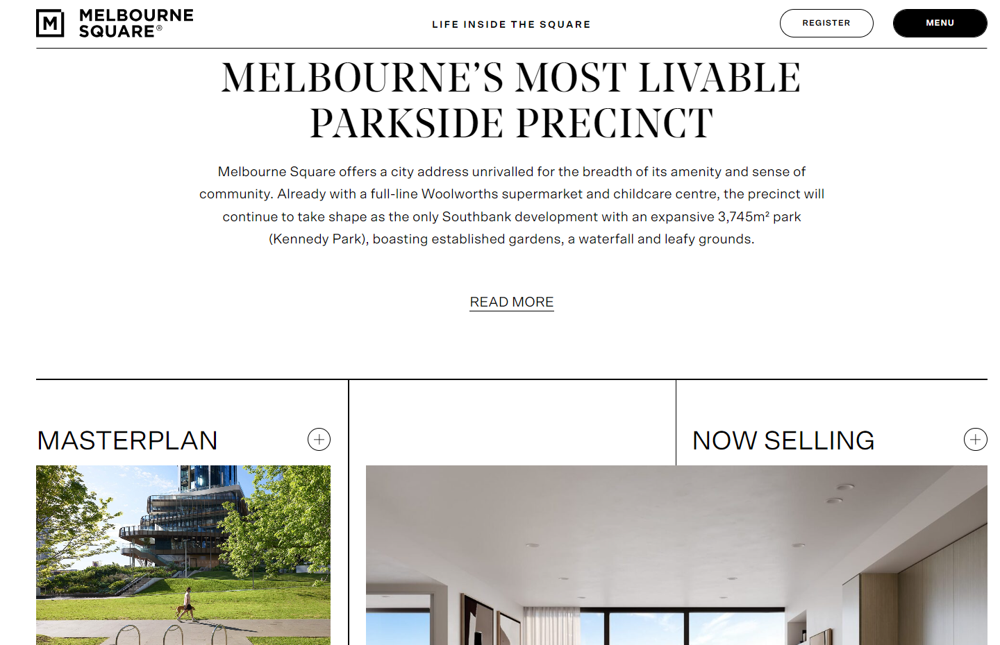

# Melbourne Square

- **Client:** 10X Digital Group
- **Tech Stack:** PHP, MySQL, WordPress, Elementor, Astra Theme
- **Project Type:** Business Website

### 🏢 About the Client

Melbourne Square is a landmark precinct that's changing the face of urban living in Melbourne's Southbank. Featuring a vast range of amenities like a full-line Woolworths supermarket, an innovative state-of-the-art childcare centre, and the picturesque landscaped Kennedy Park covering 3,745m², the precinct provides a lifestyle unlike anywhere else in the city. It was apparent there was a necessity for an inspiring, user-friendly digital presence — one that could match the scope, vision, and sense of community of the precinct.

### 🚧 The Challenge: Design That Matches Vision

The main task was to establish a digital identity that encapsulates the high-life experience of Melbourne Square. The website had to not just market the living and office space but also proclaim the special amenities such as Kennedy Park, community facilities, and expansion – and do so without disrupting the user experience.

10X Digital Group commissioned us to develop a website that would be both a digital brochure and a community hub for prospective residents, investors, and tourists.

### 💡 Our Approach  

We developed the Melbourne Square website on WordPress, utilizing the Elementor builder for ease of use and rapid turnaround. The Astra Theme gave us a lightweight, highly customizable base, enabling us to focus on performance and design harmony.

### Key Implementation Highlights:

- **Clean and Elegant UI/UX Design:** Drawing inspiration from Melbourne Square's architecture and landscaping, we employed minimalist design features with a premium look to reflect the brand.
- **Personalized Sections for Major Amenities:** Special modules were created to highlight every amenity — from Woolworths to Kennedy Park — through vibrant imagery and easy navigation.
- **Responsive and Mobile-First Design:** With a vast majority of users accessing through mobile devices, we made sure the site performed without a hitch on all screen sizes.
- **SEO-Optimized Content Structure:** Caring page structuring and metadata was done to aid organic search visibility and better user engagement.

### 📈 Results  

The completed website delivers an immersive digital experience that brings Melbourne Square to life online. It effectively conveys the spirit of the development — contemporary, dynamic, and community-focused. Clean design, compelling imagery, and responsive functionality ensure ease of use and accessibility to offerings and building a connection with the brand.

### Outcomes:

- Elevated brand presence with a polished, contemporary website
- Higher inquiries and user interaction
- A future-proofed platform poised for continued updates and expansions
